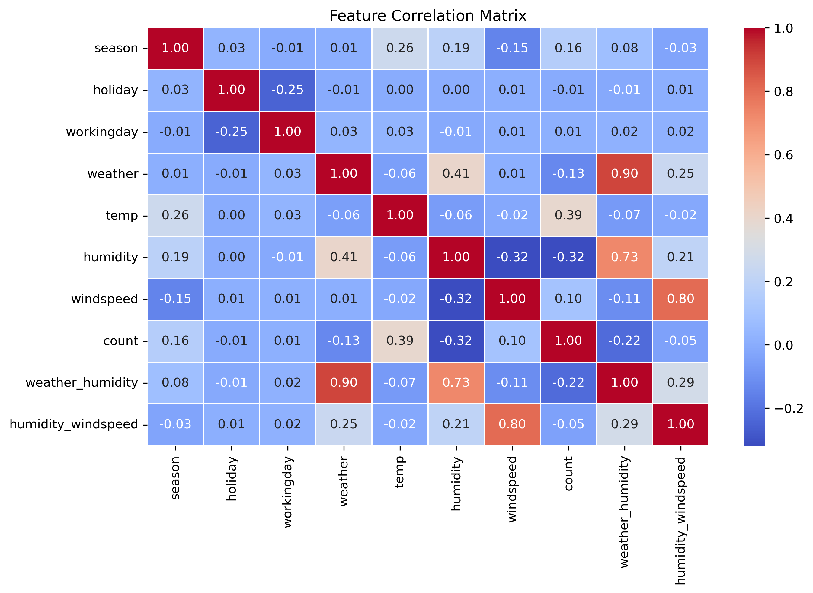

# 📊 Bike Sharing Demand Prediction Report

## 1️⃣ Introduction  
This project aims to predict **bike rental demand** using machine learning models trained with **AutoGluon**. The dataset is sourced from the **Kaggle Bike Sharing Demand competition**, which includes features such as **weather conditions, timestamps, and seasonal effects**. The goal is to minimize **RMSE (Root Mean Squared Error)** and identify the best-performing model.  

## 2️⃣ Feature Engineering Approach  
The datetime column was engineered to create new features to provide more time-based information when training the model.

### **🔹 Step 1: Adding Time-Based Features**  
- Assumed **time-related features** (e.g., `hour`, `month`) could improve predictions.
- Created `hour`, `month` and `rush_hour` from the `datetime` column.
- This led to a significant RMSE improvement from **52.98 → 30.57**.  

### **🔹 Step 2: Adding Interaction Features**  
- Selected **moderately correlated features** (e.g., `weather`, `humidity`, `windspeed`).
- Created **interaction features** such as `windspeed * humidity` to capture potential relationships.

### **📊 Feature Correlation Heatmap**
To understand the impact of adding interaction features, we generated a correlation heatmap:

#### **🔍 Key Insights**
- **High correlation detected:** Some interaction features (e.g., `temp * humidity`) were strongly correlated with existing features.
- **Multicollinearity issue:** This redundancy weakened model performance instead of improving it.
- **Feature selection adjustment:** Based on this, we removed interaction features to avoid overfitting.

## 3️⃣ Model Training Overview  
### 🏁 Baseline Model  
- Used **AutoGluon’s `TabularPredictor`** with default settings.
- Trained on the full dataset with `count` as the label.
- RMSE score obtained: **52.98**.  

### 🛠 Feature Engineering Impact  
| **Feature Set** | **RMSE Score** | **Observation** |
|---------------|-------------|----------------|
| Baseline Model (Default Features) | **52.98** | No feature engineering applied. |
| Time-Based Features Added | **30.57** | Significant improvement. `hour` and `month` added. |
| Interaction Features Added | **30.87** | Slightly worse due to multicollinearity. |

## 4️⃣ Results & Model Comparison  
| Model | Kaggle Score | RMSE Score | Fit Time (s) | Predict Time (s) | Best Model Type |
|--------|-----------|-------------|-------------|----------------|----------------|
| Baseline (AutoGluon Default) | 1.79680 | 52.982261 | 335.457640 | 22.879514 | WeightedEnsemble_L3 |
| Feature Engineered Model (datetime features)| 0.61670 | 30.570485 | 405.330824 | 25.945760 | WeightedEnsemble_L3 |
| Feature Engineered Model (interaction features)| 0.66653 | 30.874522 | 361.120610 | 23.320942 | WeightedEnsemble_L3 |

**🏆 Best Model:** WeightedEnsemble_L3 with datetime feature engineering  

## 5️⃣ Conclusion  
- **Feature engineering had a major impact on model accuracy.**  
- **Time-based features improved RMSE significantly**, confirming their relevance.  
- **Interaction features introduced redundancy** and did not contribute positively. Care should be taken when engineering new features to avoid multicollinearity.  

## 6️⃣ Next Steps  
- **Implement a Flask API** to deploy the trained model and serve predictions.
- **Perform structured hyperparameter tuning** to further refine model performance.
- **Investigate additional feature engineering techniques** to extract more useful patterns.  

## 🔗 References  
- **Kaggle Competition**: [Bike Sharing Demand](https://www.kaggle.com/c/bike-sharing-demand)  
- **AutoGluon Documentation**: [AutoGluon Tabular](https://auto.gluon.ai/stable/tutorials/tabular/index.html)  
